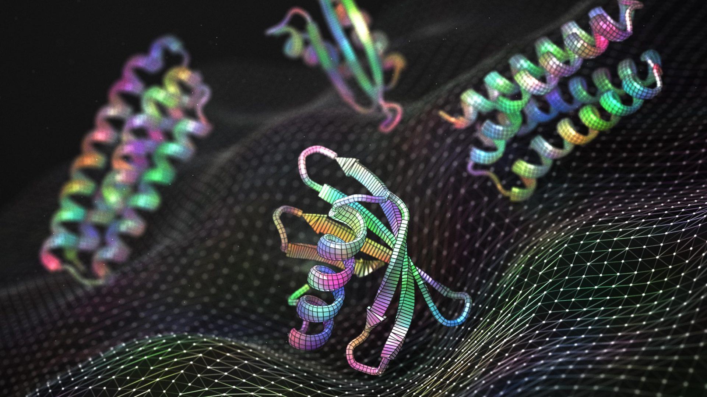

# Protein Sequence Generator

https://www.bakerlab.org/2023/05/08/deep-learning-improves-protein-binder-design-tenfold/

## Description

This project is a Protein Sequence Generator that utilizes a Long Short-Term Memory (LSTM) neural network to generate new protein sequences based on existing ones from the UniProt Swiss-Prot database. The model learns patterns in protein sequences and generates sequences that mimic real proteins.

## Project Initialization

### Prerequisites

- Python 3.10 >=
- pip package manager.

## Install Dependencies

Navigate to the project directory and install the required packages using:

`pip install -r requirements.txt`.

#### Download the Dataset.

You need to download the protein sequence dataset from UniProt:

Visit the UniProtKB website: https://www.uniprot.org  
Select the FASTA format.  
Save the file as `data/uniprot_sprot.fasta` in the project directory.

### Training the Model

Run the following command to train the model:

`python train_model.py`

This script will:  
Load and preprocess the protein sequences.  
Train the ProteinLSTM model.  
Save the trained model `models/protein_lstm_model.pth` and the amino acid mappings (`models/aa_to_int.pth` and `models/int_to_aa.pth`).

### Generating Protein Sequences

After training, generate new protein sequences by running:

`python generate_sequence.py`

This script will:  
Load the trained model and amino acid mappings.  
Generate a new protein sequence based on a random seed sequence.

### Sample Output

Below is an example of a generated protein sequence:

#### Generated Protein Sequence:

The sequence consists of single-letter codes for amino acids, following the standard IUPAC notation.  
Each letter corresponds to one of the 20 standard amino acids found in proteins.  
`FHGKDCTRRPMMDKHDITCDPTDPMTKMEIHCMHPMIKDHTDCQNPNISPISDDPPKCPDPKPRRRRSSSSMMMHHHKMHIQIQDSSSSNRNSNSNNSPNRRMTKPMMRRRPRPPPPPPPPPKKQRKQQRNQQRNRNRQ`

### Notes

- Customization: You can adjust parameters like `num_records`, `sequence_length`, `num_epochs`, and `num_generated` in the code files to suit your needs.
- Dataset Size: By default, the code uses 100 protein sequences for training. For better results, consider increasing `num_records` to include more sequences.
- Model Parameters: Feel free to experiment with the model's hyperparameters such as `embedding_dim`, `hidden_dim`, and `num_layers`.
